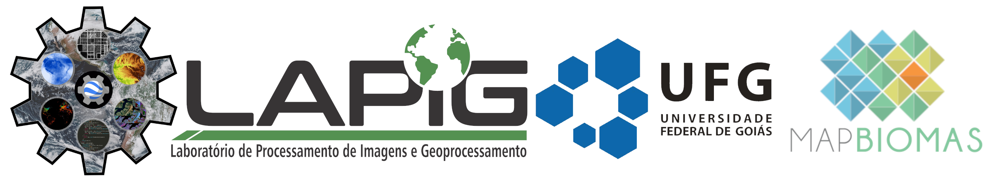

# Pasture Mapping Codes

This repository organizes the pasture mapping codes developed by [Remote Sensing and GIS Lab (LAPIG/UFG)](https://www.lapig.iesa.ufg.br/). The methology used by LAPIG team is avaliable in the paper of [PARENTE et al. (2017)](https://www.sciencedirect.com/science/article/pii/S0034425719303207) 

## Overview
This repository contains a script for classifying pasture areas using Sentinel-2 imagery, the LAPIG/MapBiomas sampling dataset, and IBGE's 1:250,000 topographic charts. The classification is performed using Google Earth Engine (GEE) with a Random Forest classifier. The script automates data preprocessing, spectral index calculation, cloud masking, and classification, exporting the results to Google Drive.


**Requirements**:

* Python 3.9 or above
  
* Gdal python package and Gdal Binaries
  
* scipy python package

* joblib python package
  
* Earth Engine python library

* An active GEE account
  
* An folder synchronization with Google Drive ([For Windows](https://www.google.com/drive/download/) | [For Unix](https://github.com/odeke-em/drive))
  
**Recommendations for Windows**: 
* Install [Miniconda - Python > 3.9]([https://python-poetry.org/docs/#windows-powershell-install-instructions](https://docs.anaconda.com/miniconda/) or above and the [Gdal package](https://anaconda.org/conda-forge/gdal). For Windows users, we need to add some system variables like:
      
* PATH =  C:\ProgramData\Miniconda3\Library\bin;
* GDAL_DATA = C:\ProgramData\Miniconda3\Library\share\gdal
  
**Recommendations for Unix**:

* Install Python-Gdal and Gdal Binaries (sudo apt-get install -y python-gdal; sudo apt-get install -y gdal)

* Install Earth Engine python library. [Click here to see how to install and configure with Python PIP.](https://developers.google.com/earth-engine/guides/python_install )

# How to use

## 1. Run classification in Google Earth Engine (GEE)

You have 2 options for make your classification:

### Using Python with GEE

## Installation
### 1. Install dependencies
```bash
pip install earthengine-api
```

### 2. Authenticate Google Earth Engine
```bash
earthengine authenticate
```

### 3. Clone the repository
```bash
git clone https://github.com/your-repo/sentinel-2-pasture-classification.git
cd sentinel-2-pasture-classification
```

## Usage
Run the script by specifying the desired year and optionally a specific chart:
```bash
python run_sentinel_2_pasture_Col2_MapBiomas_parseRun.py --year 2023 --chart SE-22-X-A
```

### Parameters:
- `--year`: The target year for classification (e.g., `2023`).
- `--chart`: (Optional) Specific IBGE chart to process. If omitted, all charts will be processed.

## Functionality
### 1. Spectral Index Calculation
The script computes vegetation indices such as NDVI, NDWI, CAI, CRI1, and others.

### 2. Temporal Feature Reduction
Reduces image collections using median, min, max, standard deviation, and amplitude calculations.

### 3. Cloud Masking
Applies cloud and shadow masks based on Google's Cloud Score+ dataset.

### 4. Classification
Uses a Random Forest classifier trained on LAPIG/MapBiomas samples.

### 5. Export
Exports the classification result to Google Drive in GeoTIFF format.

## Output
- **Filename Format**: `br_pasture_s2_col2_v1_<chart>_<year>.tif`
- **Storage**: Google Drive (`lapig_br_pasture_mapping_s2_v1` folder)
- **Resolution**: 10m per pixel

### Using JavaScript in GEE

* [Access this link](https://code.earthengine.google.com/308ef5da906db6b588c466d45b925f3b) and, if desired, change the parameters of ***year***, ***IBGE_Chart***, ***my_folder***. After that you can click in **Run** and export your result in **Task**.

## 2. Prepare the data for Multidimensional Median Filter

Merge the classifications files by year using the binaries **gdalbuildvrt** and **gdal_translate*. E.g.:

* gdalbuildvrt lapig_pasture_map_|year xxxx|.vrt *_|year xxxx|_*.tif
* gdal_translate lapig_pasture_map_|year xxxx|.vrt lapig_pasture_map_|year xxxx|.tif -co COMPRESS=LZW -co BIGTIFF=YES

In addition, if you want to view a file in a GIS like QGIS, just add a pyramid to your data using:

* gdaladdo -ro lapig_pasture_map_<year xxxx>.tif 2 4 8 --config COMPRESS_OVERVIEW LZW --config USE_RRD YES

## 3. Applying the multidimensional median filter (3 x 3 x 5)

This code need 2 arguments to run, the **<input directory>** and the **<output directory>** (e.g. python 2_Multidimensional_median_filter prob_rasters_dir filtered_rasters_dir).

```shell

python 2_Multidimensional_median_filter_parallel.py <input_dir_name> <output_dir_name>

```

## 4. Merging the files... again.

Like in the section 2, we will use the *gdalbuildvrt* and *gdal_translate* to merge the result files by year.

<details>
<summary> <b>Changelog</b> </summary>
<p>* Version 3.0 released (Github version)</p>
</details>

## Contribution
Feel free to submit issues or pull requests to improve the script!

## License
This project is licensed under the MIT License.
